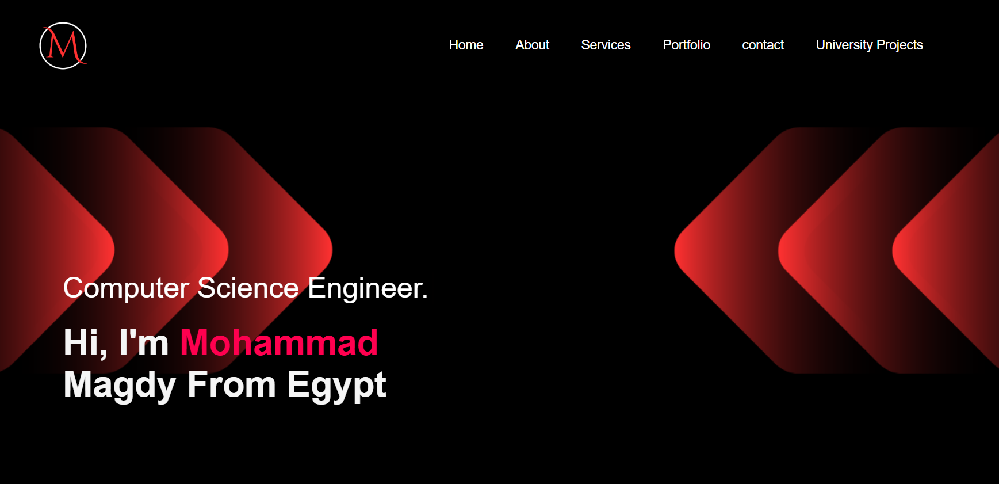
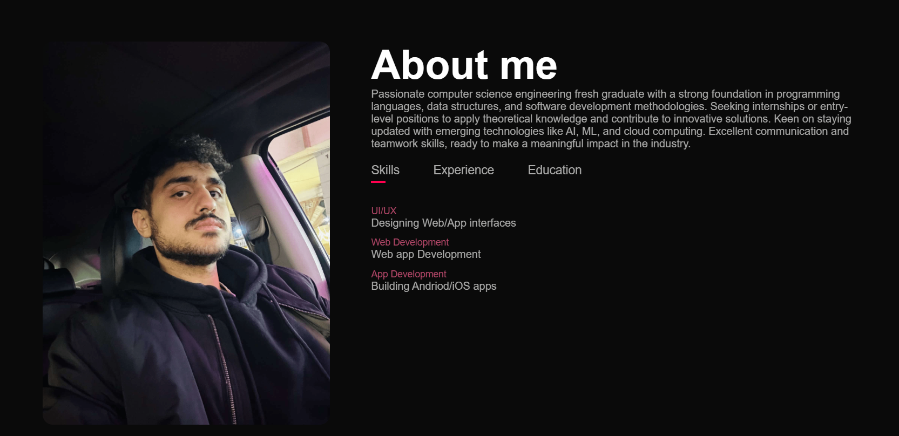
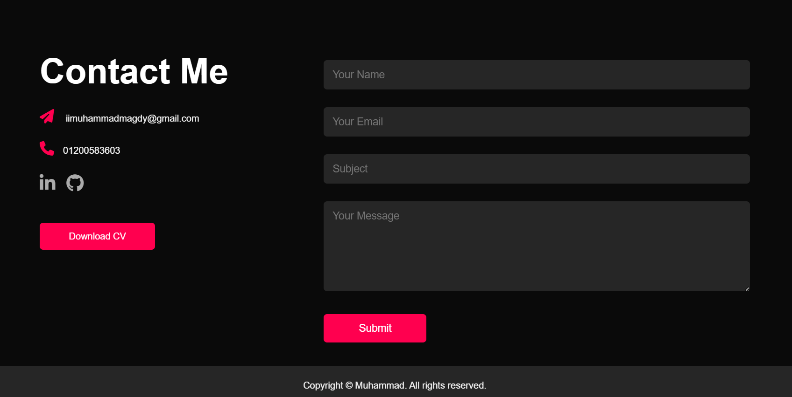
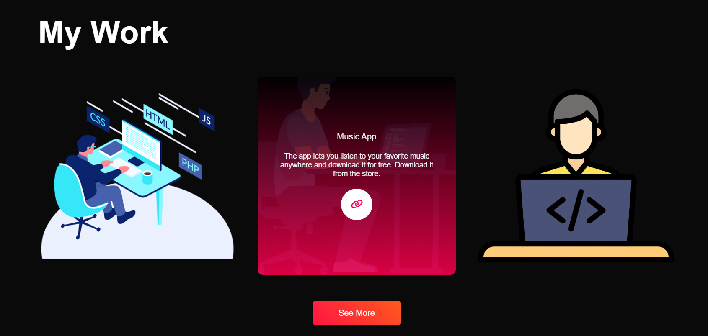
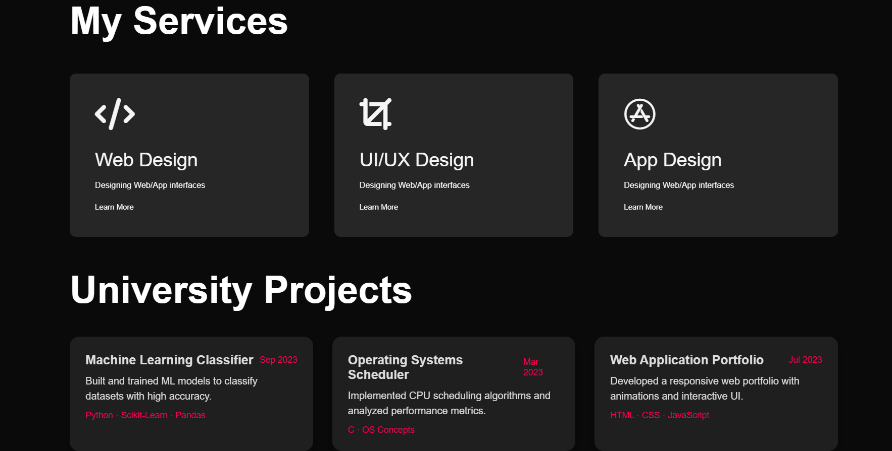
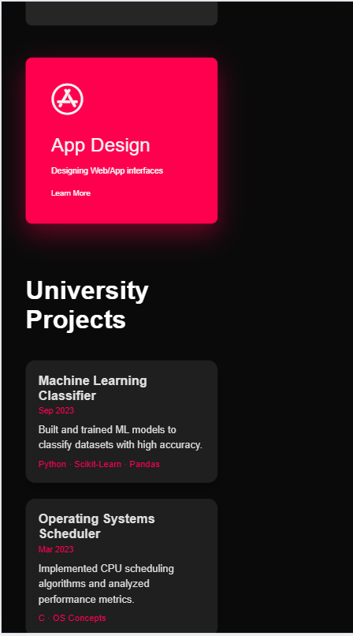

# Personal Portfolio Website

A responsive personal portfolio website built using **HTML** and **CSS**.  
It showcases my skills, university projects, work experience, and contact information.  
Designed with smooth animations, modern UI, and mobile-friendly responsiveness.

---

## Features

- Fully responsive design for desktop and mobile  
- Animated sections: fade-in, slide-up, zoom effects  
- Services, Portfolio, and University Projects sections  
- Contact form connected to Google Sheets  
- Smooth scroll navigation  
- Modern gradient buttons and interactive hover effects  

---

## University Projects

| Project | Description | Technologies | Date |
|---------|-------------|-------------|------|
| Machine Learning Classifier | Built and trained ML models to classify datasets with high accuracy. | Python · Scikit-Learn · Pandas | Sep 2023 |
| Operating Systems Scheduler | Implemented CPU scheduling algorithms and analyzed performance metrics. | C · OS Concepts | Mar 2023 |
| Web Application Portfolio | Developed a responsive web portfolio with animations and interactive UI. | HTML · CSS · JavaScript | Jul 2023 |
| Data Analysis Dashboard | Created dashboards for data visualization and reporting. | Python · Matplotlib · Pandas | May 2023 |
| Android Notes App | Developed an Android app to take and organize notes. | Java · Android Studio | Apr 2023 |
| Banking System Simulation | Simulated banking transactions and account management. | C++ · OOP | Feb 2023 |
| E-commerce Website | Built a mock online shopping site with responsive design. | HTML · CSS · JavaScript | Jan 2023 |
| IoT Temperature Monitor | Monitored temperature using sensors and displayed in real-time. | Arduino · C | Dec 2022 |
| Chatbot Implementation | Created a rule-based chatbot for FAQ responses. | Python · NLTK | Nov 2022 |
| Image Processing Project | Applied filters and transformations to images using OpenCV. | Python · OpenCV | Oct 2022 |


## Screenshots

 

  
  




This README is **professional, complete, and GitHub-friendly**.  

If you want, I can also **add badges** at the top for GitHub Pages, HTML, CSS, and “Portfolio Live” — it will make it look extra polished and modern.  

Do you want me to do that next?

## Installation

1. Clone the repository:  
   ```bash
   git clone https://github.com/MuhammadMagdyy/personal-portfolio.git
